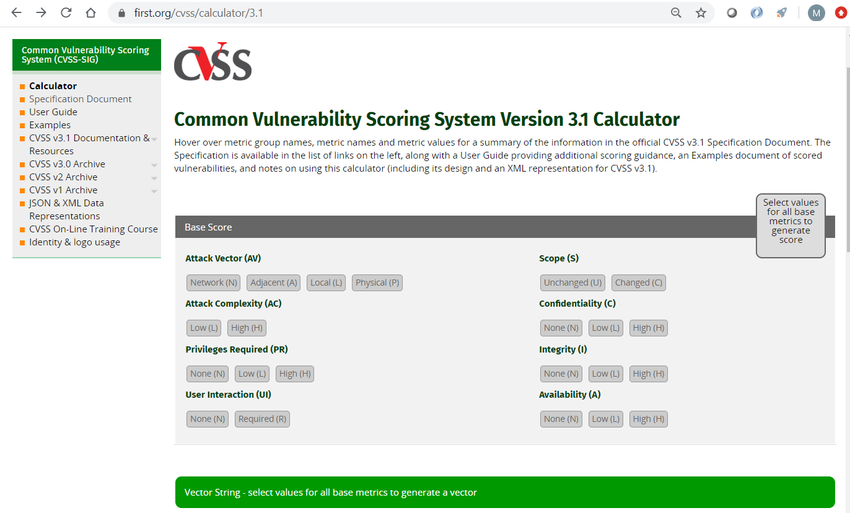
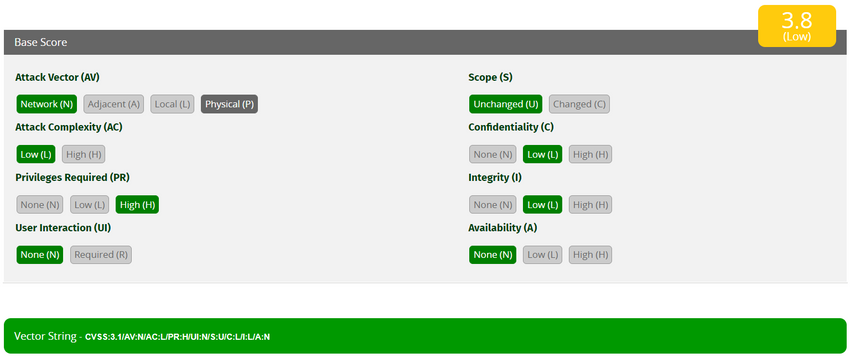
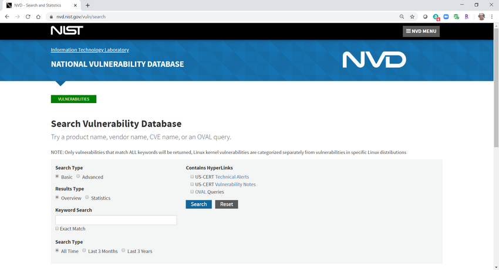

# Módulo 4: Evaluación de vulnerabilidades de terminales

4.1.1 Perfiles de la Red

Con el fin de detectar incidentes de seguridad graves, es importante comprender, describir y analizar la información sobre el funcionamiento normal de la red. Las redes, los servidores y los hosts demuestran todos un comportamiento típico durante un momento determinado. La creación de perfiles de redes y dispositivos puede proporcionar una línea de base estadística que sirve como punto de referencia. Las desviaciones inexplicables del valor de referencia pueden indicar un riesgo.

Se debe tener cuidado al capturar datos de línea base para que todas las operaciones normales de red se incluyan en la línea base. Además, es importante que la línea base sea actual. No debe incluir datos de rendimiento de red que ya no forman parte del funcionamiento normal. Por ejemplo, los aumentos en la utilización de la red durante las operaciones periódicas de copia de seguridad del servidor forman parte del funcionamiento normal de la red y deben formar parte de los datos de línea base. Sin embargo, la medición del tráfico que corresponde al acceso externo a un servidor interno que se ha movido a la nube no lo sería. Un medio para capturar el período adecuado para la medición de la línea base se conoce como detección de anomalías de ventana deslizante. definir una ventana que es más representativa de la operación de red y elimina los datos que están desactualizados. Este proceso continúa con mediciones de referencia repetidas para garantizar que las estadísticas de medición de línea base muestren el funcionamiento de la red con la máxima precisión.

La mayor utilización de enlaces WAN en momentos inusuales puede indicar una violación de la red y exfiltración de datos. Los hosts que comienzan a acceder a servidores de Internet oscuros, resuelven dominios que se obtienen a través de DNS dinámicos o usan protocolos o servicios que no son necesarios para el usuario del sistema también pueden indicar un compromiso. Las desviaciones en el comportamiento de la red son difíciles de detectar si no se conoce el comportamiento normal.

Herramientas como NetFlow y Wireshark pueden utilizarse para describir las características de tráfico de red normal. Debido a que las organizaciones pueden realizar diferentes demandas en sus redes según la hora del día o el día del año, la línea de base de la red debe llevarse a cabo durante un período prolongado. La figura muestra algunas preguntas que se deben hacer al establecer una línea base de red.

La tabla enumera elementos importantes del perfil de red.

| ¿Elemento de perfil de red?                    | Descripción                                                                                                                    |
| ---------------------------------------------- | ------------------------------------------------------------------------------------------------------------------------------ |
| **Duración de la sesión**                      | Este es el tiempo entre el establecimiento de un flujo de datos y su terminación.                                              |
| **Rendimiento total**                          | Esta es la cantidad de datos que pasan de una fuente determinada a un destino determinado en un período de tiempo determinado. |
| **Puertos utilizados**                         | Esta es una lista de procesos TCP 0 UDP que están disponibles para aceptar datos.                                              |
| **Espacio de direcciones de activos críticos** | Estas son las direcciones IP o la ubicación lógica de sistemas o datos esenciales.                                             |

\
Además, un perfil de los tipos de tráfico que normalmente entran y salen de la red es una herramienta importante para comprender el comportamiento de la red. El malware puede utilizar puertos inusuales que no suelen verse durante el funcionamiento normal de la red. El tráfico de host a host es otra métrica importante. La mayoría de los clientes de la red se comunican directamente con los servidores, por lo que un aumento del tráfico entre los clientes puede indicar que el malware se extiende lateralmente por la red.

Por último, otro indicador valioso son los cambios en el comportamiento de los usuarios, según lo indicado por AAA, los registros de servidor o un sistema de creación de perfiles de usuario (como Cisco Identity Services Engine \[ISE]). Saber cómo utilizan habitualmente la red los usuarios permite detectar posibles riesgos en las cuentas de usuario. Un usuario que, de pronto, comienza a conectarse a la red en momentos extraños desde una ubicación remota, debe encender las alarmas si este comportamiento no es el habitual.

4.1.3 Detección de Anomalías en la Red

Es posible describir el comportamiento de la red mediante una gran cantidad de datos diferentes, como las características del flujo de paquetes, las particularidades de los mismos paquetes y la telemetría derivada de múltiples fuentes. Un enfoque para la detección de ataques a la red es el análisis de estos datos diferentes sin estructurar mediante técnicas de análisis de datos masivos. Esto se conoce como análisis de comportamiento de red (network behavior analysis NBA).

Esto implica el uso de técnicas sofisticadas de estadística y aprendizaje mecanizado para comparar los valores de referencia del funcionamiento normal con el desempeño de la red en un momento específico. Las desviaciones significativas pueden indicar la existencia de riesgo. Además, el comportamiento de la red se puede analizar en busca de comportamientos de red conocidos que indiquen un compromiso.

La detección de anomalías puede reconocer el tráfico de red causado por la actividad del gusano que muestra un comportamiento de exploración. La detección de anomalías también puede identificar hosts infectados en la red que están buscando otros hosts vulnerables.

En la figura, se ejemplifica una versión simplificada de un algoritmo diseñado para detectar una situación inusual en los routers de frontera de una empresa.

<figure><figcaption></figcaption></figure>

Por ejemplo, el analista de ciberseguridad podría proporcionar los siguientes valores:

* X = 5
* Y = 100
* Z = 30
* N = 500

Ahora bien, el algoritmo se puede interpretar como: cada 5 minutos, obtener una muestra de 1/100 de los flujos durante el segundo 30. Si el número de flujos es mayor que 500, generar una alarma. Si el número de flujos es menor que 500, no hacer nada. Este es un ejemplo sencillo del uso de un perfil de tráfico para identificar el potencial de pérdida de datos.

Además de los enfoques estadísticos y de comportamiento para la detección de anomalías es la detección de anomalías basada en reglas. La detección basada en reglas analiza paquetes decodificados para ataques basados en patrones predefinidos.

4.1.4 Pruebas de Vulnerabilidad de la Red

La mayoría de las organizaciones se conectan a redes públicas de alguna manera debido a la necesidad de acceder a Internet. Estas organizaciones también deben proporcionar servicios de acceso a Internet de varios tipos al público. Debido a la gran cantidad de vulnerabilidades potenciales y al hecho de que se pueden crear nuevas vulnerabilidades dentro de la red de una organización y sus servicios de acceso a Internet, las pruebas de seguridad periódicas son esenciales.

La tabla enumera varios tipos de pruebas que se pueden realizar.

| Término                          | Descripción                                                                                                                                                                                                                                                                                                                                                                                                                                                                                                                                                                                                                                                                                                                                                                                                                                                                                                                                |
| -------------------------------- | ------------------------------------------------------------------------------------------------------------------------------------------------------------------------------------------------------------------------------------------------------------------------------------------------------------------------------------------------------------------------------------------------------------------------------------------------------------------------------------------------------------------------------------------------------------------------------------------------------------------------------------------------------------------------------------------------------------------------------------------------------------------------------------------------------------------------------------------------------------------------------------------------------------------------------------------ |
| **Análisis de riesgo**           | <ul><li>Esta es una disciplina en la que los analistas evalúan el riesgo que representan las vulnerabilidades para una organización específica.</li><li>Un análisis de riesgos incluye la evaluación de la probabilidad de ataques, identifica los tipos de posibles actores de amenazas y evalúa el impacto de las explotaciones exitosas en la organización.</li></ul>                                                                                                                                                                                                                                                                                                                                                                                                                                                                                                                                                                   |
| **Evaluación de vulnerabilidad** | <ul><li>Esta prueba emplea software para escanear servidores de Internet y redes internas en busca de varios tipos de vulnerabilidades.</li><li>Estas vulnerabilidades incluyen infecciones desconocidas, debilidades en los servicios de base de datos orientados a la web, parches de software faltantes, puertos de escucha innecesarios, etc.</li><li>Las herramientas para la evaluación de vulnerabilidades incluyen la plataforma OpenVAS de código abierto, Microsoft Baseline Security Analyzer, Nessus, Qualys y los servicios FireEye Mandiant.</li><li>La evaluación de vulnerabilidades incluye, pero va más allá, la exploración de puertos.</li></ul>                                                                                                                                                                                                                                                                       |
| **Pruebas de penetración**       | <ul><li>Este tipo de prueba utiliza ataques simulados autorizados para probar la solidez de la seguridad de la red.</li><li>El personal interno con experiencia en hackers, o hackers éticos profesionales, identifica los activos que podrían ser el objetivo de los actores de amenazas.</li><li>Se utiliza una serie de exploits para probar la seguridad de esos activos.</li><li>Las herramientas de software de explotación simulada se utilizan con frecuencia.</li><li>Las pruebas de penetración no solo verifican que existan vulnerabilidades, sino que en realidad explotan esas vulnerabilidades para determinar el impacto potencial de una explotación exitosa.</li><li>Una prueba de penetración individual a menudo se conoce como prueba de penetración.</li><li>Metasploit es una herramienta utilizada en pruebas de penetración.</li><li>CORE Impact ofrece software y servicios de pruebas de penetración.</li></ul> |

En la lista de tablas se enumeran ejemplos de actividades y herramientas que se utilizan en las pruebas de vulnerabilidad.

| Actividad                        | Descripción                                                                                                                               | Herramientas                                                  |
| -------------------------------- | ----------------------------------------------------------------------------------------------------------------------------------------- | ------------------------------------------------------------- |
| **Análisis de riesgo**           | Las personas realizan un análisis exhaustivo de los impactos de los ataques en los activos y el funcionamiento de la empresa principal.   | Consultores internos o externos, marcos de gestión de riesgos |
| **Evaluación de vulnerabilidad** | Gestión de parches, escaneos de host, escaneo de puertos, otros escaneos y servicios de vulnerabilidad                                    | OpenVas, Microsoft Baseline Analyzer, Nessus, Qualys, Nmap    |
| **Pruebas de penetración**       | Uso de técnicas y herramientas de piratería para penetrar las defensas de la red e identificar la profundidad de la penetración potencial | Metasploit, CORE Impact, Hackers éticos                       |

\

4.2.1 Descripción General de CVSS

El Sistema Común de Puntuación de Vulnerabilidades (Common Vulnerability Scoring System CVSS) es una herramienta de evaluación de riesgos que está diseñada para transmitir los atributos comunes y la gravedad de las vulnerabilidades en los sistemas de hardware y software. La tercera revisión, CVSS 3.0, es un marco de trabajo abierto estándar del sector e independiente de proveedores que permite ponderar los riesgos de una vulnerabilidad mediante una variedad de métricas. Estas ponderaciones se combinan para proporcionar una puntuación del riesgo inherente en una vulnerabilidad. La puntuación numérica puede utilizarse para determinar la urgencia de la vulnerabilidad y la prioridad de abordarla. Los beneficios de CVSS pueden resumirse del siguiente modo:

* Proporciona puntuaciones estandarizadas de vulnerabilidades a las que se les debe dar importancia en las organizaciones.
* Proporciona un marco de trabajo abierto que tiene disponible el significado de cada métrica para todos los usuarios.
* Ayuda a priorizar el riesgo de una manera que tenga sentido para las organizaciones individuales.

El Foro de Respuesta a Incidentes y Equipos de Seguridad (FIRST, Forum of Incident Response and Security Teams) fue designado como custodio de CVSS para promover su adopción a nivel mundial. El estándar Versión 3 fue desarrollado con contribuciones de Cisco y otros socios de la industria. La versión 3.1 fue lanzada en junio de 2019. La figura muestra la página de especificación para el CVSS en el sitio Web de FIRST.

<figure><figcaption></figcaption></figure>

4.2.2 Grupos de Métricas CVSS

Antes de realizar una evaluación de CVSS, es importante conocer las palabras clave que se utilizan en el instrumento de evaluación.

Muchas de las métricas hacen referencia a la función de lo que CVSS llama una autoridad. Una autoridad es una entidad informática, como una base de datos, un sistema operativo o una caja de arena virtual, que otorga y administra el acceso y los privilegios a los usuarios.

**Grupos de Métricas de CVSS**

<figure><figcaption></figcaption></figure>

Grupo de Métricas Base

Como se muestra en la figura, el CVSS utiliza tres grupos de métricas para evaluar la vulnerabilidad.

* **Explotabilidad** - Estas son características del ataque, como el vector, la complejidad y la interacción del usuario que requiere el ataque.
* **Métricas de impacto** - Los impactos del ataque enraizados en la tríada CIA de confidencialidad, integridad y disponibilidad

Grupo de Métricas Temporarias

Mide las características de una vulnerabilidad que pueden cambiar con el tiempo, pero no en cada entorno de usuario. Con el paso del tiempo, la gravedad de una vulnerabilidad cambiará a medida que se detecte y se desarrollen medidas para contrarrestarla. La gravedad de una vulnerabilidad nueva puede ser alta, pero disminuirá a medida que se desarrollen parches, firmas y otros.

Grupo de Métricas Ambientales

Mide los aspectos de una vulnerabilidad que están arraigados en el entorno de una organización específica. Estas métricas ayudan a evaluar las consecuencias dentro de una organización y permiten ajustar las métricas que son menos relevantes para lo que hace una organización.

**pos de Métricas de CVSS**

En la figura, se ven los mismos grupos de métricas de CVSS que antes, con el grupo de métricas básicas destacado.Vector de ataqueImpacto sobre la confidencialidadComplejidad del ataqueImpacto sobre la integridadPrivilegios necesariosImpacto sobre la disponibilidadInteracción con el usuarioAlcanceGrupo de métricas baseGrupo de métricas ambientalesGrupo de métricas temporariasMétricas de la posibilidad de ataqueMétricas de impactoMadurez del código del ataqueNivel de correcciónConfianza del informeRequisito de confidencialidadMétricas base modificadasRequisito de integridadRequisito de disponibilidad

La tabla enumera los criterios para las métricas de Explotabilidad del Grupo de Métricas Base.

| Criterios                   | Descripción                                                                                                                                                                                                                                                                            |
| --------------------------- | -------------------------------------------------------------------------------------------------------------------------------------------------------------------------------------------------------------------------------------------------------------------------------------- |
| **Vector de ataque**        | Esta es una métrica que refleja la proximidad del actor de amenazas al componente vulnerable. Cuanto más alejado esté el actor de la amenaza del componente, mayor será la gravedad. Los actores de amenazas cerca de su red o dentro de su red son más fáciles de detectar y mitigar. |
| **Complejidad del ataque**  | Esta es una métrica que expresa la cantidad de componentes, software, hardware o redes que están fuera del control del atacante y que deben estar presentes para que una vulnerabilidad se explote con éxito.                                                                          |
| **Privilegios requeridos**  | Esta es una métrica que captura el nivel de acceso que se requiere para explotar con éxito la vulnerabilidad.                                                                                                                                                                          |
| **Interacción del usuario** | Esta métrica expresa la presencia o ausencia del requisito de interacción del usuario para que un exploit tenga éxito.                                                                                                                                                                 |
| **Alcance**                 | Esta métrica expresa si varias autoridades deben estar involucradas en un exploit. Esto se expresa como si la autoridad inicial cambia a una segunda autoridad durante el exploit.                                                                                                     |

Las métricas de impacto del grupo de métricas básicas aumentan con el grado o la consecuencia de la pérdida por el componente afectado. La tabla muestra los componentes de la métrica de impacto.

| Término                         | Descripción                                                                                                                                                                                                                                                                                                                  |
| ------------------------------- | ---------------------------------------------------------------------------------------------------------------------------------------------------------------------------------------------------------------------------------------------------------------------------------------------------------------------------- |
| **Impacto de confidencialidad** | Esta es una métrica que mide el impacto en la confidencialidad debido a una vulnerabilidad explotada con éxito. La confidencialidad se refiere a la limitación del acceso solo a usuarios autorizados.                                                                                                                       |
| **Impacto de integridad**       | Esta es una métrica que mide el impacto en la integridad debido a una vulnerabilidad explotada con éxito. La integridad se refiere a la confiabilidad y autenticidad de la información.                                                                                                                                      |
| **Impacto de disponibilidad**   | Esta es una métrica que mide el impacto en la disponibilidad debido a una vulnerabilidad explotada con éxito. La disponibilidad se refiere a la accesibilidad de la información y los recursos de la red. Los ataques que consumen ancho de banda de red, ciclos de procesador o espacio en disco afectan la disponibilidad. |

\
4.2.4 El Proceso de CVSS

El Grupo de Métricas Base de CVSS está diseñado como una forma de evaluar las vulnerabilidades de seguridad que se encuentran en los sistemas de software y hardware. Permite describir la gravedad de una vulnerabilidad de acuerdo con las características de un ataque exitoso de dicha vulnerabilidad. Los otros grupos de métricas modifican la puntuación de gravedad básica determinando cómo se ve afectada dicha puntuación por factores temporales y del entorno.

El Proceso de CVSS utiliza una herramienta llamada Calculadora CVSS v3.1, la cual se muestra en la figura.

<figure><figcaption></figcaption></figure>

La calculadora es como un cuestionario en el que se toman decisiones que describen la vulnerabilidad para cada grupo de métricas. Después de realizar todas las elecciones, se genera una puntuación. El texto emergente que explica cada métrica y cada valor de métrica se muestra al pasar el mouse sobre cada una. Las elecciones se realizan seleccionando un valor para cada métrica. Se puede elegir solamente un valor por métrica.

Se puede acceder a la calculadora CVSS en la parte CVSS del PRIMER sitio web.

Para respaldar el proceso, hay disponible una guía del usuario detallada que definir criterios de métricas, ejemplos de evaluaciones de vulnerabilidades comunes y la relación de los valores de las métricas con la puntuación final.

Una vez completado el grupo de Métricas base, se muestra la clasificación numérica de gravedad, como se muestra en la figura.

<figure><figcaption></figcaption></figure>

A fin de calcular una puntuación para los grupos de métricas temporales o del entorno, primero se debe completar el grupo de métricas básicas. Después, los valores de las métricas temporales y del entorno modificarán los resultados de las métricas básicas para proporcionar una puntuación general. La interacción de las puntuaciones para los grupos de métricas se muestra en la figura.

\
4.2.5 Informes de CVSS

Los rangos de puntajes y el significado cualitativo correspondiente se muestran en la tabla.

| Clasificación | Puntaje CVSS |
| ------------- | ------------ |
| Ninguno       | 0            |
| Bajo          | 0.1 – 3.9    |
| Medio         | 4.0 – 6.9    |
| Elevado       | 7.0 – 8.9    |
| Crítico       | 9.0 – 10.0   |

Con frecuencia, las puntuaciones de los grupos de métricas básicas y temporales se suministrarán a los clientes de parte del proveedor de la aplicación o de seguridad en cuyo producto se haya detectado la vulnerabilidad. La organización afectada completa el grupo de métricas del entorno para adaptar la puntuación suministrada por el proveedor al contexto local.

La puntuación obtenida sirve para orientar a la organización afectada en la asignación de recursos para afrontar la vulnerabilidad. Mientras mayor sea la clasificación de gravedad, mayor será el impacto potencial de un ataque y mayor la urgencia de afrontar la vulnerabilidad. Aunque no son tan precisas como las puntuaciones numéricas de CVSS, las etiquetas cualitativas son muy útiles para comunicarse con las partes interesadas que son incapaces de entender las puntuaciones numéricas.

En general, debe afrontarse cualquier vulnerabilidad que supere el valor de 3,9. Cuanto mayor sea el nivel de clasificación, mayor será la urgencia de obtener una solución.

4.2.6 Otras Fuentes de Información sobre Vulnerabilidades

Hay otras fuentes de información importantes sobre vulnerabilidades. Estas trabajan en conjunto con CVSS para proporcionar una evaluación completa de la gravedad de las vulnerabilidades. Hay dos sistemas que funcionan en los Estados Unidos:

**Vulnerabilidades y Exposiciones Comunes (CVE, Common Vulnerabilities and Exposures)**

Se trata de un diccionario de nombres comunes, en forma de identificadores de CVE, que hacen referencia a vulnerabilidades de ciberseguridad conocidas. El identificador de CVE proporciona una manera estandarizada de investigar una referencia a las vulnerabilidades. Cuando se identifica una vulnerabilidad, los identificadores de CVE pueden utilizarse para tener acceso a soluciones. Además, los servicios de inteligencia de amenazas utilizan identificadores de CVE y aparecen en diversos registros de los sistemas de seguridad. El sitio web con detalles sobre CVE incluye un enlace entre las puntuaciones de CVSS y la información de CVE. Permite navegar por los registros de vulnerabilidades de CVE según la clasificación de gravedad de CVSS.

Busque Mitre en Internet para obtener más información sobre CVE como se muestra en la figura.

<figure><figcaption></figcaption></figure>

<figure><figcaption></figcaption></figure>

4.3.1 Administración de Riesgos

La gestión de riesgos implica seleccionar y especificar controles de seguridad para una organización. Es parte de un programa continuo de seguridad de la información en toda la organización que involucra la gestión de riesgos de la organización o de personas en relación con el funcionamiento de un sistema.

La gestión de riesgos es un proceso continuo y cíclico de varios pasos, como se ve en la figura.

**Un Proceso de Gestión de Riesgos**

<figure><figcaption></figcaption></figure>

riesgos

El riesgo se determina como la relación entre la amenaza, la vulnerabilidad y la naturaleza de la organización. Primero, consiste en responder las siguientes preguntas como parte de la evaluación del riesgo:

* ¿Quiénes son los actores de amenaza que quieren atacarnos?
* ¿Qué vulnerabilidades pueden explotar los actores de amenazas?
* ¿Cómo pueden afectarnos los ataques?
* ¿Cuál es la probabilidad de que ocurran diferentes ataques?

La publicación especial de 800-30 del NIST describe la evaluación de riesgos como:

_(…) el proceso de identificar, calcular y priorizar los riesgos de seguridad de la información. Evaluar el riesgo requiere un cuidadoso análisis de la información sobre amenazas y vulnerabilidades para determinar el grado en que ciertas circunstancias o eventos podrían afectar negativamente una organización y la probabilidad de que tales circunstancias o eventos tengan lugar._

La publicación completa está disponible para su descarga desde NIST.

Una actividad obligatoria en la evaluación de riesgos es identificar amenazas y vulnerabilidades y relacionarlas entre sí mediante un proceso que suele denominarse vinculación entre amenaza y vulnerabilidad (T-V, threat-vulnerability). Luego, estos vínculos T-V pueden utilizarse como referencia para indicar la existencia de riesgo antes de que se implementen los controles de seguridad. Esta referencia puede entonces compararse con evaluaciones de riesgo continuas como medio para evaluar la efectividad en la gestión de riesgos. Esta parte de la evaluación de riesgos se denomina determinación del perfil de riesgo inherente de una organización.

Después de que se identifican los riesgos, es posible asignarles una puntuación o ponderarlos como una forma de priorizar estrategias de reducción del riesgo. Por ejemplo, las vulnerabilidades que se han correspondido con múltiples amenazas pueden recibir clasificaciones más altas. Además, los vínculos T-V que se asignen al impacto institucional máximo recibirán también ponderaciones más altas.

La tabla enumera las cuatro formas posibles de responder a los riesgos que se han identificado, en función de sus ponderaciones o puntuaciones.

| Riesgo                   | Descripción                                                                                                                                                                                                                                                                                                                                                                                                                                                                      |
| ------------------------ | -------------------------------------------------------------------------------------------------------------------------------------------------------------------------------------------------------------------------------------------------------------------------------------------------------------------------------------------------------------------------------------------------------------------------------------------------------------------------------- |
| **Evitar el riesgo**     | <ul><li>Dejar de realizar las actividades que generan riesgo.</li><li>Es posible que como resultado de una evaluación de riesgos, se determinar que el riesgo involucrado en una actividad supera el beneficio de la actividad para la organización.</li><li>Si se determina que esto es cierto, entonces se puede determinar que la actividad debe interrumpirse.</li></ul>                                                                                                     |
| **Reducción de riesgos** | <ul><li>Disminuir el riesgo tomando medidas para reducir la vulnerabilidad.</li><li>Esto implica implementar los enfoques de gestión discutidos anteriormente en este capítulo.</li><li>Por ejemplo, si una organización utiliza sistemas operativos de servidor que suelen ser el objetivo de los actores de amenazas, el riesgo se puede reducir asegurando que los servidores se parcheen tan pronto como se identifiquen las vulnerabilidades.</li></ul>                     |
| **Riesgo compartido**    | <ul><li>Transferir parte del riesgo a otras partes.</li><li>Por ejemplo, una técnica de riesgo compartido podría ser externalizar algunos aspectos de las operaciones de seguridad a terceros.</li><li>La contratación de un CSIRT de seguridad como servicio (SECaaS) para realizar el monitoreo de seguridad es un ejemplo.</li><li>Otro ejemplo es comprar un seguro que ayudará a mitigar algunas de las pérdidas financieras debidas a un incidente de seguridad.</li></ul> |
| **Retención de riesgo**  | <ul><li>Aceptar el riesgo y sus consecuencias.</li><li>Esta estrategia es aceptable para riesgos que tienen un impacto potencial bajo y un costo de mitigación o reducción relativamente alto.</li><li>Otros riesgos que se pueden retener son aquellos que son tan dramáticos que no se pueden evitar, reducir o compartir de manera realista.</li></ul>                                                                                                                        |

\
4.3.3 Administración de Vulnerabilidades

Según el NIST, la administración de vulnerabilidades es una práctica de seguridad diseñada para prevenir de forma proactiva la explotación de las vulnerabilidades de IT que existen dentro de una organización. Tiene por objetivo reducir el tiempo y el dinero invertidos en solucionar las vulnerabilidades y su aprovechamiento. La administración proactiva de las vulnerabilidades de los sistemas reducirá o eliminará el potencial de explotación e implicará considerablemente menos tiempo y esfuerzo que responder después de que se haya producido una explotación o ataque.

La administración de vulnerabilidades requiere una metodología sólida para identificar vulnerabilidades usando boletines de seguridad de proveedores y otros sistemas de información, como CVE. El personal de seguridad debe tener la competencia para evaluar el impacto (si lo hubiera) de la información sobre la vulnerabilidad que reciba. Las soluciones deben identificarse usando metodologías eficaces de implementación y evaluación de las consecuencias imprevistas de las soluciones implementadas. Por último, la solución se debe probar para verificar que se eliminó la vulnerabilidad.

**Ciclo de vida de la Administración de vulnerabilidades**

<figure><figcaption></figcaption></figure>

Descubrir

Haga un inventario de todos los activos en la red e identifique los detalles del host, incluidos los sistemas operativos y los servicios abiertos, para identificar vulnerabilidades. Desarrolle un valor de referencia para la red. Identifique las vulnerabilidades de seguridad usando un cronograma periódico automatizado.

Priorizar activos

Clasifique los activos en grupos o unidades comerciales y asigne un valor comercial a los grupos de activos en función de su importancia para las operaciones comerciales.

Evaluar

Determinar un perfil de riesgo de línea base para eliminar los riesgos en función de la criticidad, la vulnerabilidad, las amenazas y la clasificación de los activos.

Informar

Mida el nivel de riesgo comercial asociado con sus activos de acuerdo con sus políticas de seguridad. Documentar un plan de seguridad, monitorear la actividad sospechosa y describir vulnerabilidades conocidas.

Remediar

Priorice según el riesgo comercial y aborde las vulnerabilidades en orden de riesgo.

Verificar

Verifique que las amenazas se hayan eliminado mediante auditorías de seguimiento.

\
4.3.4 Administración de Activos

La administración de activos implica implementar sistemas que rastrean la ubicación y configuración de dispositivos y software en red en toda una empresa. Como parte de cualquier plan de administración de la seguridad, las organizaciones deben saber qué equipo tiene acceso a la red, dónde se encuentra ese equipo dentro de la empresa y su posición lógica en la red, y qué software y datos almacenan o usan esos sistemas. La administración de activos no solo realiza un seguimiento de los activos de la empresa y de otros dispositivos autorizados, sino que también puede usarse para identificar los dispositivos que no están autorizados en la red.

El NIST especifica en su publicación NISTIR 8011 (Volumen 2) los registros detallados que deben mantenerse para cada dispositivo. El NIST describe las posibles técnicas y herramientas para poner en práctica un proceso de administración de activos:

* Detección automatizada e inventario del estado actual de los dispositivos
* Articulación del estado deseado de esos dispositivos usando políticas, planes y procedimientos en el plan de seguridad de la información de la organización
* Identificación de activos autorizados que no cumplan las reglas
* Corrección o aceptación del estado del dispositivo, posible reiteración de la definición del estado deseado
* Repetición del proceso en intervalos regulares o de manera continua

En la figura, se describe este proceso a grandes rasgos.

<figure><figcaption></figcaption></figure>

4.3.5 Administración de Dispositivos Móviles

La administración de dispositivos móviles (MDM, Mobile Device Management), especialmente en la era de BYOD, supone retos especiales para la administración de activos. No es posible controlar físicamente los dispositivos móviles en las instalaciones de una organización. Pueden ocurrir extravíos, robos o alteraciones, lo que pone en peligro el acceso a los datos y a la red. Parte de un plan MDM actúa cuando los dispositivos dejan la custodia de la parte responsable. Entre las posibles medidas, se incluye deshabilitar el dispositivo extraviado, encriptar los datos en el dispositivo y mejorar el acceso a los dispositivos con medidas de autenticación más resistentes.

Debido a la diversidad de dispositivos móviles, es posible que el diseño de algunos dispositivos que se usen en la red sea menos seguro que el de otros. Los administradores de redes deben adoptar la premisa de que ningún dispositivo móvil es confiable hasta que la organización lo proteja como se debe.

Los sistemas de MDM, como Cisco Meraki Systems Manager (en la figura), permiten que el personal de seguridad configure, monitoree y actualice un conjunto muy diverso de clientes móviles desde la nube.

<figure><figcaption></figcaption></figure>

4.3.6 Administración de Configuraciones

La administración de configuraciones se ocupa del inventario y control de configuraciones de hardware y software de los sistemas. Las configuraciones seguras de los dispositivos reducen los riesgos de seguridad. Por ejemplo, una organización ofrece muchas computadoras de escritorio y portátiles a sus trabajadores. Esto aumenta la superficie de ataque de la organización, ya que cada sistema puede ser vulnerable a ataques. Para ello, la organización puede crear imágenes de software y configuraciones de hardware de referencia para cada tipo de máquina. Estas imágenes pueden incluir un paquete básico de software necesario, software de seguridad para terminales y políticas de seguridad personalizadas que controlen el acceso del usuario a los aspectos de la configuración del sistema que podrían producir vulnerabilidades. Las configuraciones de hardware pueden especificar los tipos permitidos de interfaces de red y de almacenamiento externo.

La administración de configuraciones se extiende a la configuración de hardware y software de dispositivos de red y servidores. Según la definición del NIST, la administración de configuraciones:

_se compone de un conjunto de actividades encaminadas a establecer y mantener la integridad de los productos y sistemas, mediante el control de los procesos de inicialización, modificación y monitoreo de las configuraciones de esos productos y sistemas._

La publicación especial 800-128 del NIST sobre la administración de configuraciones para la seguridad de la red está disponible para su descarga desde NIST.

Para los dispositivos de interconexión de redes, hay disponibles herramientas de software que realizan copias de respaldo de las configuraciones, detectan cambios en los archivos de configuración y permiten cambiar de una vez las configuraciones en muchos dispositivos.

Con la llegada de los centros de datos y la virtualización en la nube, la gestión de varios servidores supone retos especiales. Herramientas como Puppet, Chef, Ansible y SaltStack permiten una gestión eficiente de los servidores que se utilizan en la informática basada en la nube.

4.3.7 Administración de Parches Empresariales

La administración de parches está relacionada con la administración de vulnerabilidades. Las vulnerabilidades suelen aparecer sistemas operativos y firmware esenciales de los dispositivos de clientes, servidores y redes. El software de aplicación, especialmente las aplicaciones de Internet y los marcos como Acrobat, Flash y Java, también se descubre con frecuencia por tener vulnerabilidades. La administración de parches involucra todos los aspectos de la implementación de parches de software, entre ellos, la identificación de parches necesarios, y la adquisición, distribución, instalación y comprobación de parches en todos los sistemas que los requieran. La instalación de parches suele ser la manera más efectiva de mitigar las vulnerabilidades de software. A veces, es la única manera de hacerlo.

Algunas regulaciones de cumplimiento requieren la administración de parches, como Sarbanes Oxley (SOX) y la Ley de Portabilidad y Responsabilidad de Seguros Médicos (Health Insurance Portability and Accountability Act HIPAA). Si no se implementan los parches de manera sistemática y oportuna, podrían ocurrir problemas durante las auditorías y la aplicación de sanciones por incumplimiento. La administración de parches depende de los datos de la administracón de activos para identificar los sistemas que ejecutan software que requiere parches. El software de administración de parches está disponible en empresas como SolarWinds y LANDesk. Administrador de configuración de Microsoft System Center (Microsoft System Center Configuration Manager SCCM) es una herramienta de nivel empresarial para la distribución automatizada de parches a un gran número de estaciones de trabajo y servidores de Microsoft Windows.

<figure><figcaption></figcaption></figure>

4.3.8 Técnicas de Administración de Parches

Basado en agentes

Este requiere que un agente de software se ejecute en cada host donde se implementen parches. El agente informa si hay software vulnerable instalado en el host. El agente se comunica con el servidor de administración de parches, determina si hay parches que deban instalarse y los instala. El agente se ejecuta con los privilegios suficientes para poder instalar los parches. Los enfoques con base en agentes son el método preferido para implementar parches en dispositivos móviles.

<figure><figcaption></figcaption></figure>

Análisis sin agentes

Los servidores de administración de parches analizan la red en busca de dispositivos que necesiten parches. El servidor determina qué parches se necesitan y los instala en los clientes. Solamente los dispositivos que se encuentran en segmentos de red analizados se pueden parchar de esta manera. Esto puede suponer un problema para los dispositivos móviles.

<figure><figcaption></figcaption></figure>

Los dispositivos que requieren parches se identifican mediante el monitoreo del tráfico en la red. Este enfoque solamente es efectivo para el software que incluye información sobre la versión en el tráfico de su red.

<figure><figcaption></figcaption></figure>
