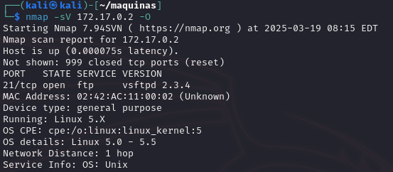

# Máquina INJECTION

Fecha: 07 de Marzo de 2025

Esta máquina la podemos encontrar en la web de [**DockerLabs**](https://dockerlabs.es/), perteneciente a ["El Pingüino de Mario"](https://www.youtube.com/channel/UCGLfzfKRUsV6BzkrF1kJGsg), que está categorizada como "muy fácil" y que he decido comenzar por ella.

Como una de las cosas mas importantes dentro de una auditoría informática ya sea de ciberseguridad o no, es la enumeración de lo que vayamos descubriendo, se hace indispensable disponer de una enumeración adecuada a los hechos que se van produciendo.

## Descargar e instalar máquina de prueba

Activada la VPN a Suiza, con una máquina virtual Kali Linux, nos vamos a la web de DockerLabs del Pingüino de Mario, y nos descargamos la primera máquina modo "Muy Fácil" que nos encontramos.

Una vez que estamos en la consola de Kali Linux, nos creamos abrimos un Terminal, nos copiamos la máquina que nos hemos descargado recientemente (llamada "injection") y la pegamos en nuestra carpeta de trabajo.

Abrimos la ruta de la carpeta, descomprimimos el fichero ZIP y tenemos dos ficheros.

<div align="left" data-full-width="false"><figure><figcaption><p>Extracción del fichero zip</p></figcaption></figure></div>

Ahora modificaremos los permisos de la máquina para que disponga de permisos de ejecución y la ejecutaremos en nuestra Terminal.

<div align="left"><figure><figcaption><p>Ejecución de la máquina en nuestro Docker local</p></figcaption></figure></div>

Una vez ejecutada, como no tenemos Docker lo primero que hace es instalarlo.

Una vez instalado Docker en esta máquina virtual, termina por decirnos la dirección IP de la máquina que acabamos de desplegar y su dirección IP, para acceder a ella.

<div align="left"><figure><figcaption><p>Despliegue de la máquina en nuestra terminal</p></figcaption></figure></div>

Una vez que ya hemos terminado y nos ha lanzado la dirección IP de la máquina que acabamos de desplegar, procedemos a comenzar con nuestra operativa.


## **Fase de Reconocimiento**

En esta fase lo mas importante es obtener la mayor enumeración de información disponible acerca de nuestro objetivo.&#x20;

Ahora nos abrimos una terminal y lanzamos un comando contra la máquina para comprobar si nos responde.

```bash
ping 172.17.0.2
```

Podemos ver que nos está retornando paquetes ICMP, así que está encendida.

<div align="left"><figure><figcaption><p>Ping a la máquina víctima</p></figcaption></figure></div>

Ahora lanzaremos un comando nmap para comenzar con la enumeración de servicios, y puertos que tiene disponibles esta maquina.

<pre class="language-bash"><code class="lang-bash"><strong>nmap -sV 172.17.0.2
</strong></code></pre>

<div align="left"><figure><figcaption><p>Nmap averiguando que servicios están disponibles</p></figcaption></figure></div>

## Fase de Explotación

Hemos encontrado los siguientes puertos:&#x20;

* 22/tcp open ssh OpenSSH 8.9p1 Ubuntu 3ubuntu0.6 (Ubuntu Linux; protocol 2.0)&#x20;
* 80/tcp open http Apache httpd 2.4.52 ((Ubuntu))

Disponemos de una conexión por SSH y un Apache, que estará sirviendo una web. Vamos a probar a entrar en esa web desde un navegador, poniendo en la URL del navegador esa dirección IP.

<div align="left"><figure><figcaption><p>Web de login realizada en PHP</p></figcaption></figure></div>

Al entrar podemos ver un login y password. Vamos a revisar su código fuente para ver si encontramos algún indicio mas.

Vamos a probar con las típicas contraseñas... de _admin_, _administrator_... y parece que tampoco pasamos de la autenticación.

Hemos intentado conectarnos por SSH y tampoco hemos conseguido entrar, dado que nos pide una contraseña con el usuario Kali.

Ok, podemos probar con la herramienta **DirBuster**, pero no logro hacerla funcionar.

### SQL Injection

Parece que me estoy desviando del camino. Puede que si realizo una _**SQL Injection,**_ vamos a probar con la inyección SQL clásica para intentar entrar por este método introduciendo _"**admin' or 1=1-- -**"_ para que siempre sea verdadero, y cualquier cosa en la _**password**_.

<div align="left"><figure><figcaption><p>Probando la inyección SQL</p></figcaption></figure></div>

Y _vuala_, acabamos de acceder al sistema. Vemos como la web nos entrega un mensaje de bienvenida para el usuario Dylan. Y nos revela la contraseña del mismo.

## Fase de Post-Explotación

Podría ser que esa contraseña sirva para entrar por la consola SSH, y así poder hacer una escalada de privilegios y ya entrar hasta en la cocina...

```bash
ssh dylan@172.17.0.2
```

Ponemos la contraseña que hemos encontrado y...

<div align="left"><figure><figcaption></figcaption></figure></div>

Buscamos los ficheros con permisos de usuario root

```
find / -perm -4000 -user root 2>/dev/null
```

<figure><figcaption></figcaption></figure>

Acabamos de obtener acceso a la máquina.

```
sudo env /bin/sh
```

<div align="left"><figure><figcaption></figcaption></figure></div>

Fin de la auditoría.

```bash
                             | |
  _____      ___ __   ___  __| |
 / _ \ \ /\ / / '_ \ / _ \/ _` |
| (_) \ V  V /| | | |  __/ (_| |
 \___/ \_/\_/ |_| |_|\___|\__,_|
```
